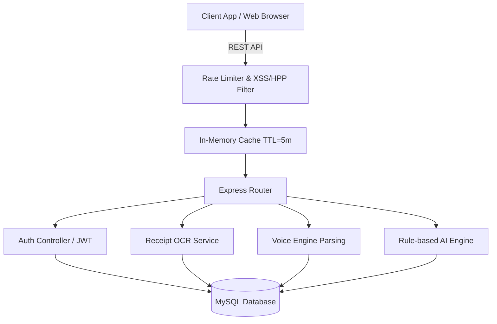

# System Design Document

## Architecture Diagram

## Design Decisions

### Why Node.js & Express?
The platform requires rapid I/O for handling multipart form data (receipt uploads) and high concurrent throughput for analytical queries. Node.js's event-driven, non-blocking architecture makes it perfect for a lightweight API server. Express provides minimal overhead and massive ecosystem support for securing headers (Helmet) and handling CORS.

### Why MySQL?
Financial data is inherently relational. Transactions must map strictly to specific Users and Categories. Ensuring ACID compliance, enforcing Foreign Key constraints, and leveraging mathematical aggregations natively within SQL `SUM()` queries optimizes calculation times rather than iterating large arrays in Node.js.

### Why JWT (JSON Web Tokens)?
JWT enables stateless authentication. We don't need to query a sessions table on every single request, meaning the Node.js layer can instantly decrypt the token locally to extract the `userId`. This scales infinitely behind load balancers.

### How OCR Works (Tesseract)
When a user uploads a receipt, `multer` writes the file temporarily to `/uploads`. The `receiptService` then feeds the file path into `Tesseract.js` which natively executes Optical Character Recognition on a separate worker thread. The resulting text block is then parsed by regex to identify numeric amounts (e.g., `TOTAL: $15.50`) and common merchant names.

### How Voice Recognition Works
The frontend leverages the native HTML5 `Web Speech API` (SpeechRecognition) to convert spoken words into text. The raw string is transmitted to the backend where `voiceParser.js` runs algorithmic natural language extraction. It detects keywords (like "spent" = Expense, "received" = Income) and isolates numeric integers from the string before dynamically creating SQL records.

### How AI Insights Work
Since external APIs (OpenAI/Gemini) were prohibited for cost/privacy reasons, a robust **Rule-Based Engine** was engineered. The AI module fetches aggregated spending across the last 30 days, compares it to the stated budget limits, evaluates category distribution anomalies (e.g., spending 60% of income on "Food"), and generates logical text suggestions based on mathematically predefined health thresholds.

### Notification Flow
A generation endpoint analyzes all active budgets versus spent amounts. If spending breaches 80% or 100% of a threshold, it inserts a `Critical` or `Warning` status row into the `notifications` table. The frontend polls or retrieves these on login to update a notification bell UI.

### Caching Strategy
A 5-minute TTL LRU memory cache intercepts high-computation routes (Dashboard, AI Insights, Report Summaries). This drops repetitive database load significantly during the user's active session while ensuring data isn't excessively stale.
